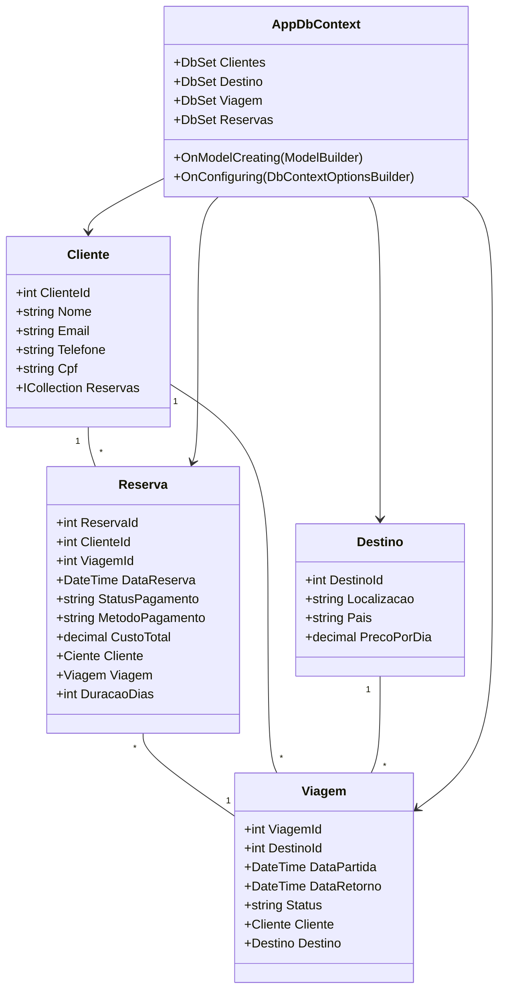
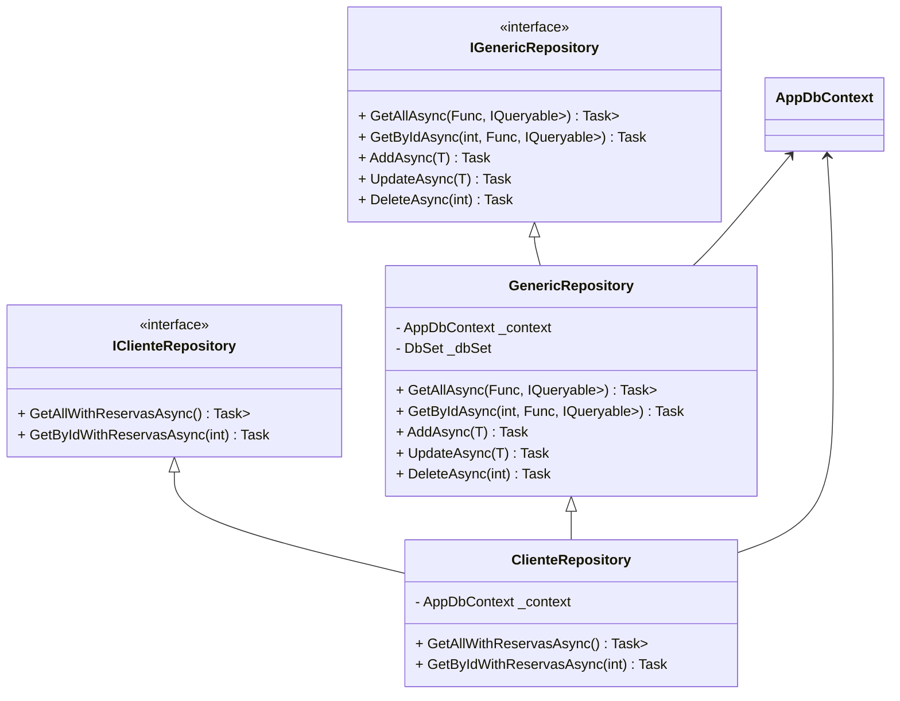

# Sistema de Gestão de Viagens - Minimal API em C#

Este projeto é uma Minimal API em C# para gerenciamento de reservas de viagem de avião. O sistema permite que clientes façam reservas para destinos especificos.

## Funcionalidades

- Cadastro de Clientes: Gerencia informações dos clientes, como nome, e-mail, telefone e CPF.
- Cadastro de Destinos: Registra destinos para viagens, incluindo dados como nome, localização, país e preço.
- Cadastro de Reservas: Cria, Consulta e Atualiza reservas de viagens para determinados destinos.

## Diagrama de Pacotes da Arquitetura MVC


##  Diagrama de classes por Camadas

### CONTROLLER LAYER

```mermaid
classDiagram
    ClienteController --> IClienteService
    DestinoController --> IDestinoService
    ReservaController --> IReservaService
    ViagemController --> IViagemService
    RelatorioController --> IReportService
    IClienteService --> IClienteRepository
    IDestinoService --> IGenericRepository
    IReservaService --> IGenericRepository
    IViagemService --> IGenericRepository
    ClienteController ..> ClienteDTO : uses
    ClienteController ..> ClienteCreateDTO : uses
    ClienteController ..> ClienteUpdateDTO : uses
    DestinoController ..> DestinoDTO : uses
    DestinoController ..> DestinoCreateDTO : uses
    ReservaController ..> ReservaDTO : uses
    ReservaController ..> ReservaCreateDTO : uses
    ViagemController ..> ViagemDTO : uses
    ClienteDTO --> Cliente : maps to
    ClienteCreateDTO --> Cliente : maps to
    ClienteUpdateDTO --> Cliente : maps to
    DestinoDTO --> Destino : maps to
    DestinoCreateDTO --> Destino : maps to
    ReservaDTO --> Reserva : maps to
    ReservaCreateDTO --> Reserva : maps to
    ViagemDTO --> Viagem : maps to

    class ClienteController {
        - IClienteService _clienteService
        + GetAll() Task<ActionResult<IEnumerable<ClienteDTO>>>
        + GetById(int) Task<ActionResult<ClienteDTO>>
        + Create(ClienteCreateDTO) Task<ActionResult>
        + Update(int, ClienteUpdateDTO) Task<ActionResult>
        + Delete(int) Task<ActionResult>
    }

    class DestinoController {
        - IDestinoService _destinoService
        + GetAll() Task<ActionResult<IEnumerable<DestinoDTO>>>
        + GetById(int) Task<ActionResult<DestinoDTO>>
        + Create(Destino) Task<ActionResult>
        + Update(int, DestinoDTO) Task<ActionResult>
        + Delete(int) Task<ActionResult>
    }

    class ReservaController {
        - IReservaService _reservaService
        + GetAll() Task<ActionResult<IEnumerable<ReservaDTO>>>
        + GetById(int) Task<ActionResult<ReservaDTO>>
        + Create([FromBody] ReservaCreateDTO) Task<ActionResult>
        + Update(int, ReservaDTO) Task<ActionResult>
        + Delete(int) Task<ActionResult>
    }

    class ViagemController {
        - IViagemService _viagemService
        + GetAll() Task<ActionResult<IEnumerable<ViagemDTO>>>
        + GetById(int) Task<ActionResult<ViagemDTO>>
        + Update(int, ViagemDTO) Task<ActionResult>
        + Delete(int) Task<ActionResult>
    }

    class RelatorioController {
        - IReportService _reportService
        + GetReservasPorPeriodo() IActionResult
        + GetDestinosMaisProcurados() IActionResult
        + GetClientesFrequentes() IActionResult
        + GetReceitaPorViagem() IActionResult
    }

    class IClienteService {
        <<interface>>
        + GetAll() Task<IEnumerable<ClienteDTO>>
        + GetById(int) Task<ClienteDTO>
        + Create(ClienteCreateDTO) Task
        + Update(int, ClienteUpdateDTO) Task
        + Delete(int) Task
    }

    class IDestinoService {
        <<interface>>
        + GetAll() Task<IEnumerable<DestinoDTO>>
        + GetById(int) Task<DestinoDTO>
        + Create(DestinoCreateDTO) Task
        + Update(int, DestinoDTO) Task
        + Delete(int) Task
    }

    class IReservaService {
        <<interface>>
        + GetAll() Task<IEnumerable<ReservaDTO>>
        + GetById(int) Task<ReservaDTO>
        + Create(ReservaCreateDTO) Task
        + Update(int, ReservaDTO) Task
        + Delete(int) Task
    }

    class IViagemService {
        <<interface>>
        + GetAll() Task<IEnumerable<ViagemDTO>>
        + GetById(int) Task<ViagemDTO>
        + Update(int, ViagemDTO) Task
        + Delete(int) Task
    }

    class IReportService {
        <<interface>>
        + ObterReservasPorPeriodo() Task<IEnumerable<string>>
        + ObterDestinosMaisProcurados() Task<IEnumerable<string>>
        + ObterClientesFrequentes() Task<IEnumerable<string>>
        + ObterReceitaPorViagem() Task<IEnumerable<string>>
    }

    class ClienteDTO {
        + int ClienteId
        + string Nome
        + string Email
        + string Telefone
        + string Cpf
        + ICollection<ReservaDTO> Reservas
    }

    class ClienteCreateDTO {
        + string Nome
        + string Email
        + string Telefone
        + string Cpf
    }

    class ClienteUpdateDTO {
        + string Nome
        + string Email
        + string Telefone
        + string Cpf
    }

    class DestinoDTO {
        + string Localizacao
        + string Pais
        + decimal PrecoPorDia
    }

    class DestinoCreateDTO {
        + string Localizacao
        + string Pais
        + decimal PrecoPorDia
    }

    class ReservaCreateDTO {
        + int ClienteId
        + DateTime DataReserva
        + string StatusPagamento
        + string MetodoPagamento
    }

    class ReservaDTO {
        + int ReservaId
        + int ClienteId
        + int ViagemId
        + DateTime DataReserva
        + string StatusPagamento
        + string MetodoPagamento
        + decimal CustoTotal
        + ViagemDTO Viagem
    }

    class ViagemDTO {
        + int ViagemId
        + int DestinoId
        + DateTime DataPartida
        + DateTime DataRetorno
        + string Status
    }
```




### MODEL LAYER




### REPOSITORY LAYER




## Estrutura de arquivos e pastas
```shell
📂 ProjetoRaiz 
  ├── 📂 Controllers # Mapeamento dos endpoints para CRUD
  ├── 📂 Data # Classe AppDbContext que mapeia as Classes de Model para o Banco de dados em memória
  ├── 📂 Middleware # Tratamento de exceções
  ├── 📂 Models # Classes que representam as entidades (Cliente, Destino, Reserva, Viagem)
  ├── 📂 Repository # Lógica de acesso ao banco de dados e manipulação direta das entidades
  ├── 📂 Services # Implementação das regras de negócio e processamento dos dados.
  └── Program.cs # Configuração da API e mapeamento de endpoints
```
